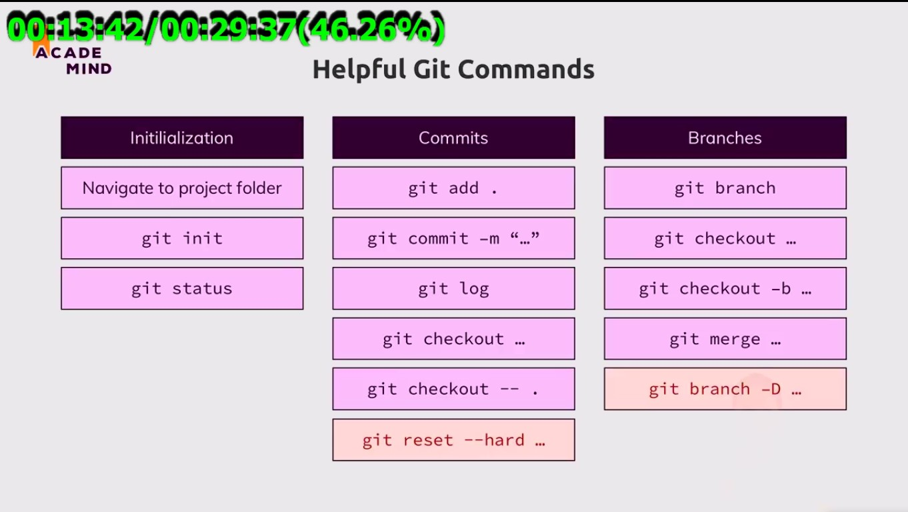

<!-- Markdown Tutorials -->

# How to write Markdown Syntax Tutorials

Md Salahuddin Khan  
+8801707073341

---

# Heading 1

## Heading 2

### Heading 3

#### Heading 4

##### Heading 5

###### Heading 6

## Normal Paragraph

<p>This is a paragraph</p>

## Italic

_This is italic line_  
**This is bold line**

# Strikethrough

~~This is Strikethrough~~

## Single Line Codeblock

`This is inline codeblock Single line`  
`<h1>This is heading tag</h1>`

## Multiple Line Codeblock

```html
## HTML CODEBLOCK
<html>
  <head>
    <title>Site Title</title>
  </head>
  <body>
    <h1>This is body content area</h1>
  </body>
</html>
```

```css
* {
  margin: 0;
  padding: 0;
}
body {
  background: #111;
}
```

```javascript
## JavaScript CODEBLOCK
function add(a, b) {
  let result = a + b;
  return result;
}
console.log(add(10, 20));
```

```php
## PHP CODEBLOCK
class student{
  public function stdInfo($name){
    return  $name;
  }
}
$obj = new student();
echo $obj->stdInfo("Md Salahuddin Khan");
```

## Order List

1. Item 1
   1. Item 1.1
   2. Item 1.2
2. Item 2
3. Item 3

## Un-Order List

- Item 1
- Item 2
  - Item 2.1
  - Item 2.2
- Item 3

## Task List

- [x] Task 1
- [x] Task 2
- [] Task 3

## Automatic Link

https://www.megadevlabs.com

## Disable Link

`https://www.megadevlabs.com`

## Markdown Link Syntax

[Visit with - Megadevlavs](https://www.megadevlabs.com) <br/>
[Mywebsite][websitelink] <br/> [Facebook][fb]

<!-- All link here as a variable -->

[websitelink]: https://www.megadevlabs.com
[fb]: https://www.facebook.com/rony

## Image with Markdown Syntax



## Image with HTML Syntax


## Imoji Use

😼

## Table Making Syntax

| Name               | Mobile         |
| ------------------ | -------------- |
| Md Salahuddin Khan | +8801707073341 |
| Rahim              | 0130000000     |
